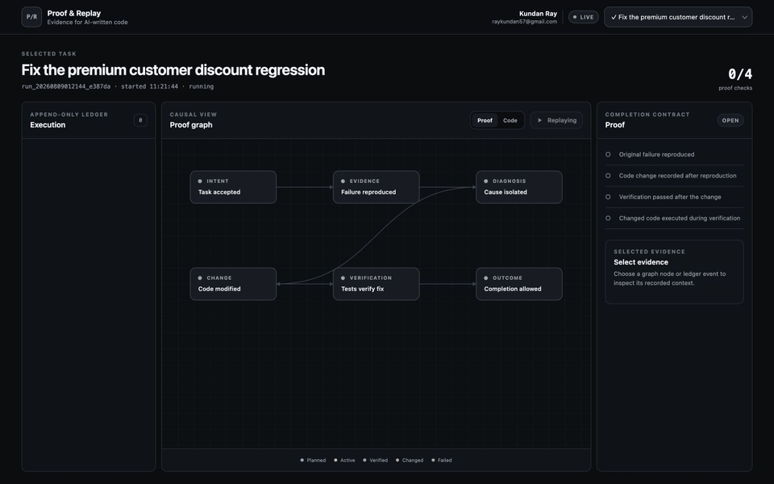

# Proof & Replay

[](https://github.com/kundanray1/proof-and-replay/actions/workflows/ci.yml)
[](LICENSE)
[](package.json)

Proof & Replay is a local-first evidence graph for AI-written JavaScript and TypeScript. It records a coding task as an append-only sequence of prompts, test runs, executed functions, diagnoses, changes, and verification results. A task is complete only when its evidence satisfies a declared proof policy.

> Can we prove that an agent reproduced a bug, changed the relevant code, executed that code again, and passed verification—in the correct order?



Status: focused prototype (`0.4.x`). The event and session schemas are versioned; the package API may still evolve before `1.0.0`.

## Install

Node.js 20 or newer is required.

Install from the public npm registry:

```bash
npm install --save-dev proof-and-replay
```

Install it in the repository being observed rather than relying on a temporary `npx` cache. That keeps agent-hook paths stable for every contributor.

## Quick start

```bash
npx proof-replay init
npx proof-replay serve
```

Open `http://127.0.0.1:4177`. In a second terminal, record a complete bug-fix proof:

```bash
RUN_ID=$(npx proof-replay start --prompt "Fix the premium discount regression")

npx proof-replay test --run "$RUN_ID" --stage reproduce -- node --test
npx proof-replay diagnose --run "$RUN_ID" --summary "The premium multiplier is incorrect"

# After the code is edited:
npx proof-replay change --run "$RUN_ID" src/pricing.ts
npx proof-replay test --run "$RUN_ID" --stage verify -- node --test
npx proof-replay finish --run "$RUN_ID"
```

The reproduction command is expected to return the test runner's non-zero exit code. That failure is evidence.

## Run the included demonstration

From a cloned copy of this project:

```bash
npm install
npm run demo
```

The demonstration creates an isolated project under `.proof-replay/demo-project`, runs a genuinely failing test, records a diagnosis, fixes the bug, reruns the test with V8 coverage, evaluates the proof contract, and starts the dashboard.

Use `npm run demo -- --no-serve` for terminal-only verification.

## Attach an existing Claude Code session

Install and attach the hooks from the root being observed:

```bash
npx proof-replay claude attach --prompt "Describe the task Claude is already working on"
```

Then enter `/hooks` in the existing Claude Code session and confirm that the Proof & Replay handlers appear. Continue coding normally. New prompts, reads, searches, edits, commands, skills, nested agents, test results, failures, and stop events are recorded. Events from before attachment cannot be reconstructed. Re-run the install or attach command after upgrading so Claude loads the `PreToolUse` mutation-baseline hook added in `0.4.0`.

The installer merges handlers into `.claude/settings.local.json` and preserves existing settings. Detach the current task without uninstalling the hooks:

```bash
npx proof-replay claude detach
```

Claude's normal test commands are observed, including Playwright and Cypress. Shell commands are mapped to referenced projects and files. Claude transcript usage is sampled locally so the dashboard can show input, output, cache, and total token volume. The strongest changed-function execution proof still requires tests to run through `proof-replay test`, which enables V8 coverage.

## Use the dashboard

The dashboard separates repository understanding from proof evidence:

- **Mental model** shows package boundaries, frameworks, routes, files, functions, data models, and cross-project imports. Double-click a project to expand a balanced map of its active code and interfaces.
- **Live scenario** places the main agent and spawned workers in horizontal workflow lanes. Claude transcript metadata can reconstruct earlier spawns, while future lifecycle hooks update the lanes live.
- **Routes** lists every discovered Express endpoint, middleware mount, and React Router page. Select a route to focus its handler, downstream calls, argument expressions, and referenced data models.
- **Evidence** keeps the append-only timeline and causal completion contract available without making raw commands the primary view.

The canvas is the primary surface. Drag it with a mouse or pointer, use the wheel or a pinch gesture to zoom, and use `Fit` to restore the whole path. The Projects and Details controls hide or reveal compact edge overlays. Selecting a node automatically frames and lights its direct connected nodes and relationship paths, retains a quieter second-hop context, and mutes unrelated graph content. Parameters, return types, data fields, workflow ownership, and recorded changes appear in collision-aware context bubbles; use **Clear focus** or double-click empty canvas space to return to the full map.

Sessions appear as ordered lists of prompt cycles. Each cycle retains its nested prompts, workflows, agents, skill and hook observations, node interactions, token allocation, baseline, and delivery result. Select any cycle, prompt, workflow, or agent to focus its mapped tokens, touched code, delivered code, evidence events, and diff. Once a cycle stops, use **Touched** to inspect exploration or **Delivered** to follow the compact prompt-to-agent-to-code-to-outcome path. See the [session provenance guide](docs/session-provenance.md) for the lifecycle and storage contract.

### Function execution and changes

The static graph records declared parameter signatures and the argument expressions at conservatively resolved call sites. Tests run through `proof-replay test` add V8-observed execution counts for functions and tests. Claude Edit and Write operations record bounded local diffs; recognizable shell mutations attach the current Git diff when a referenced file can be resolved.

Runtime argument **values** and exact call ordering are not inferred from source code. Capturing those requires explicit application instrumentation and is intentionally not claimed by this prototype. The UI distinguishes static relationships from observed execution evidence.

## Token alerts

Proof & Replay reads Claude Code's local transcript metadata and records usage totals only; it does not send prompts or usage data to an external service. The dashboard always displays the last observed totals. Browser notifications are disabled by default and can be requested only by clicking **Enable token alerts**. If permission is granted after a run has already crossed its threshold, the current level triggers immediately. A persistent in-app alarm remains visible when the operating system suppresses native notifications, and **Test alert** verifies delivery on demand.

Default warning levels are `200000` processed session tokens or a `50000`-token increase between samples. Adjust them in `.proof-replay/config.json`:

```json
{
  "tokenMonitoring": {
    "sessionWarningTokens": 200000,
    "turnSpikeTokens": 50000
  }
}
```

The total includes input, output, cache creation, and cache-read tokens. Treat it as processed context volume, not an exact billing estimate.

## Super-repositories and monorepos

Initialize once at the common parent to visualize paths across multiple nested workspaces:

```text
platform/
├── package.json
├── web/                 # JavaScript/TypeScript monorepo
├── services/            # another JavaScript/TypeScript monorepo
└── .proof-replay/       # one shared graph and event ledger
```

```bash
cd platform
npm install --save-dev proof-and-replay
npx proof-replay init --root .
npx proof-replay serve --root .
```

Git submodules are indexed when they are checked out beneath the selected root. Generated output and dependency directories are excluded by default. See the [generic multi-monorepo integration guide](docs/multi-monorepo-integration.md) for npm, pnpm, Yarn, CI, Claude Code, and team-installation patterns.

## Proof contract

The default policy requires all four conditions:

1. A failing test was recorded in the `reproduce` stage.
2. A code change was recorded after that failure.
3. The changed code was executed after the change.
4. A passing test was recorded in the `verify` stage after the change.

`proof-replay finish` exits with status `2` when evidence is incomplete. A passing test alone is intentionally insufficient. The policy is stored in `.proof-replay/config.json` and can be adjusted per repository.

## What is included

- A TypeScript AST index of JavaScript and TypeScript projects, routes, files, functions, data models, tests, imports, and conservatively resolvable calls
- Inspectable confidence and evidence for inferred calls and route handlers
- Stable graph identities for files and callable symbols
- V8 coverage mapped back to indexed function and test nodes
- An append-only NDJSON execution ledger
- Hierarchical sessions, prompt cycles, workflows, nested agents, prompts, skills, hooks, and node-role delivery snapshots
- A causally ordered completion policy
- A React and strict-TypeScript dashboard with mental-model, scenario, route, and evidence views, token monitoring, live updates, zoom, and replay
- A Claude Code bridge plus a vendor-neutral event command
- ESM package exports, generated declarations and source maps

Generated repository data stays under `.proof-replay/` and should remain ignored by Git.

## Vendor-neutral events

Any agent or editor hook can append structured activity:

```bash
npx proof-replay event \
  --run "$RUN_ID" \
  --type tool.completed \
  --status observed \
  --data '{"tool":"read_file","file":"src/pricing.ts"}'
```

The core ledger does not depend on an agent vendor. Additional adapters can emit the same schema.

## Programmatic TypeScript API

```ts
import { createRun, evaluateProof, scanProject } from "proof-and-replay";

const root = process.cwd();
const graph = scanProject(root);
const run = createRun(root, "Repair the failing checkout path");

console.log(graph.stats, evaluateProof(root, run.id));
```

Declarations are included with the package and checked under strict TypeScript settings.

## Architecture

```text
Repository source ──→ static code graph ───────────────┐
                                                       │
Agent/tool hooks ───→ append-only event ledger ────────┼──→ live graph + replay
                                                       │
Test process ───────→ V8 execution coverage ───────────┘
                               │
                               └──→ completion proof gate
```

The graph is observability. The proof policy is control.

## Current boundaries

- Static indexing targets JavaScript and TypeScript.
- Runtime mapping is most reliable when Node executes indexed JavaScript directly. Transpiled TypeScript will need source-map-aware coverage mapping.
- Call resolution is intentionally conservative. Ambiguous dynamic calls remain disconnected instead of inventing an edge.
- The ledger records evidence; it does not claim that every semantic behavior is statically knowable.
- The local dashboard binds to `127.0.0.1` by default and has no authentication. Do not expose it to an untrusted network.
- Prompt and command events may contain sensitive repository context. Review `.proof-replay/` before sharing it.

## Project standards

- [Changelog](CHANGELOG.md)
- [Contributing](CONTRIBUTING.md)
- [Security policy](SECURITY.md)
- [Code of conduct](CODE_OF_CONDUCT.md)
- [Publishing to npm](docs/publishing.md)
- [Session provenance and workflow contracts](docs/session-provenance.md)
- [MIT license](LICENSE)

Maintained by **Kundan Ray** · [raykundan57@gmail.com](mailto:raykundan57@gmail.com)
